# 0. 서론

### 도입 이유

---

- 2021.07.16 배포했었던 기능에 대한 테스트 누락으로 상용 환경에서 이슈 발생
- **전수 테스트 자동화 환경을 구축하여 배포 시 테스트가 누락되는 일이 없도록 하기위함**
- API 개수가 많을경우, Postman으로 전수 테스트하려면 일일히 하나씩 테스트해야하는 불편함이 존재
- TestMace는 케이스만 미리 작성해놓으면 클릭 한 번으로 API 전수 테스트 가능

# 1. What is TestMace?

### API 작업 및 API 테스트를 위한 도구

- 공식 레퍼런스 링크: [https://docs.testmace.com/](https://docs.testmace.com/)

### 주요 기능

---

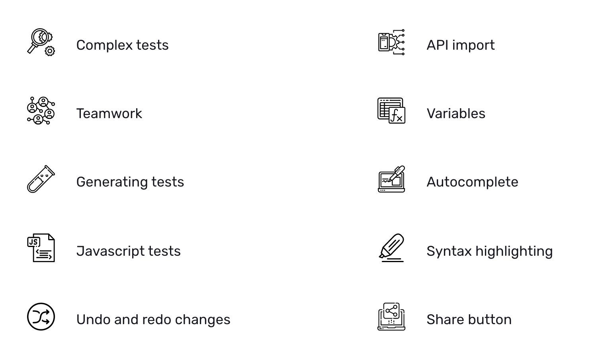

- 기능소개 영상 링크: [https://www.youtube.com/watch?v=JjsHggY8624](https://www.youtube.com/watch?v=JjsHggY8624)

### 모든 플랫폼에서 사용 가능

---


### 릴리즈 정보

---

- **2021.07.22 현재 최신버전: 1.3.3**
- 최초 릴리즈(0.0.1-beta.1): 2019.3.28
- 정식 릴리즈(1.0.0): 2020.3.13

# 2. 주요 기능

### 쉬운 테스트 생성

---

- 내장 편집기로 스크립트를 작성하지 않고도 테스트를 생성 가능
- Response Body에서도 바로 테스트 생성 가능
    
    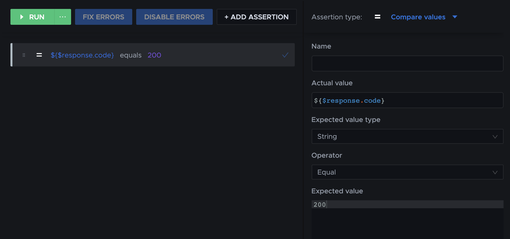
    

### 시나리오

---

- 폴더 노드로 여러 Request 노드들을 그룹화하여 하나의 테스트 시나리오를 생성 가능
- 생성된 시나리오는 한 번의 클릭만으로도 내부의 모든 하위 노드들을 테스트 가능

### Drafts

---

- Request 노드를 프로젝트 공간으로 이동시키기 전 샘플을 만드는 공간
- 프로젝트 공간과 똑같은 작업 수행가능

### 실행 취소 / 다시 실행

---

- 전체 프로젝트 내에서 작동
- 특정 노드에 대한 변경사항뿐만 아니라 생성, 삭제, 이동 등도 실행 취소 가능
- 당연한 기능인 것 같지만 Postman에는 존재하지 않음 (ex. Request를 삭제했을 때 되돌릴 수 없음)
    
    
    

### API Description

---

- API에 대한 규격 작성가능
- Swagger 2.0 / OpenAPI 3.0 로부터 Import 지원

### 간단한 노드 공유

---

- URL로 노드를 공유가능

### 프로젝트 관리 용이

---

- 각 노드들은 .yml 형식으로 저장되어서 가독성이 좋고 관리하기 용이
- 디렉토리 구조 또한 동일하게 매핑됨

### 일괄 편집 모드

---

- 헤더나 쿼리 파라미터를 일괄 편집할 수 있는 기능 제공

# 3. Node

- TestMace의 워크플로우는 다양한 노드 유형으로 구성됨
    
    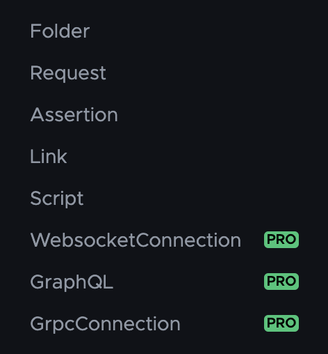
    

### Folder

---

- 노드들을 그룹화하여 하나의 테스트 시나리오를 생성할 수 있음

### Request

---

- 요청을 생성할 때 사용
- 한 개의 Assertions 노드만 자식 요소가 될 수 있음

### Assertions

---

- 테스트를 작성할 때 사용
- Request 노드에 대해서만 자식 노드가 될 수 있음

**비교 조건 종류**

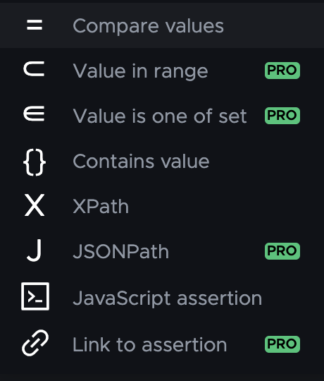

**Compare values**

- 응답과 지정한 값이 같은지 비교
    
    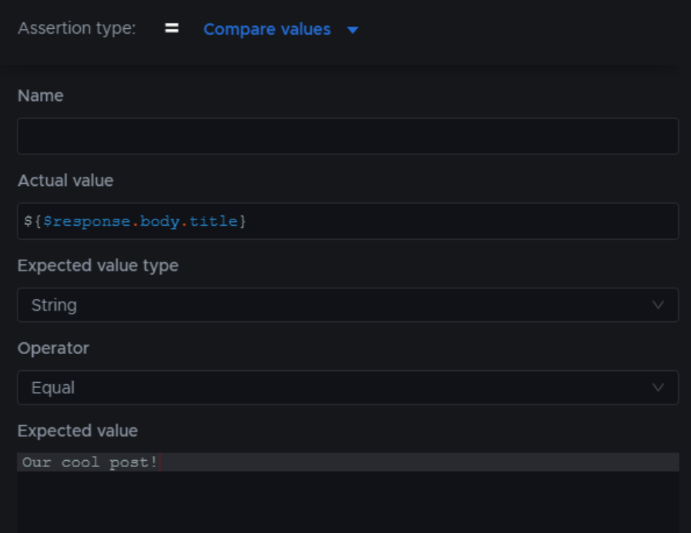
    

**Value in range**

- 응답이 범위 내에 값이 있는지 확인
    - \[ 0 ~ 10 \] - 두 범위 모두 포함
    - \[ 0 ~ 10 ) - 상한(10)은 포함 X
    - ( 0 ~ 10 \] - 하한(0)은 포함 X
    - ( 0 ~ 10 ) - 상한과 하한 모두 포함 X
- Use negative statement 옵션 활성화 시 범위 내에 값이 존재하지 않아야 true 반환
- 문자열을 비교 값으로 사용하는 것이 가능 (이 경우 알파벳 순으로 수행)
    
    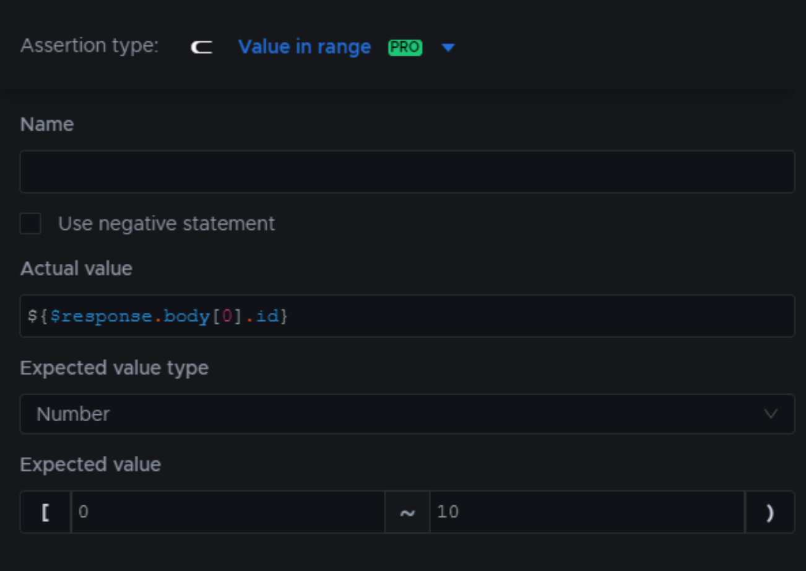
    

**Value is one of set**

- 응답이 지정한 집합의 한 값과 같은지 확인
    
    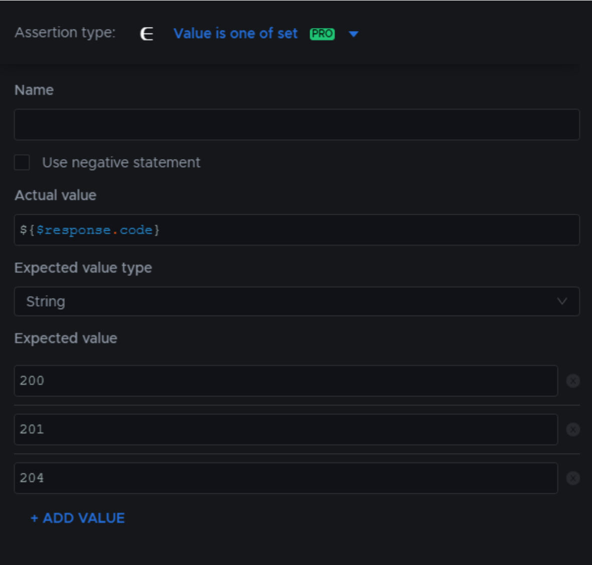
    

**Contains value**

- 응답이 지정된 문자열 또는 정규 표현식과 일치하는지 확인
- Use value as Regular Expression 옵션 활성화 시 정규 표현식 사용
    
    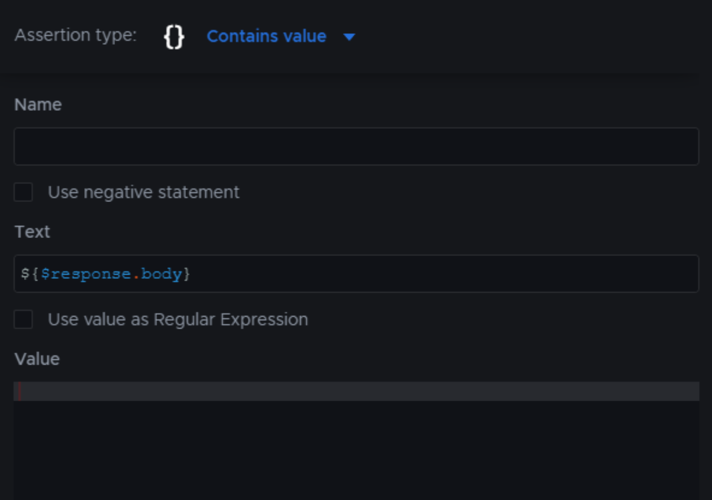
    

**XPath**

- 응답이 XPath 표현식과 일치하는지 확인
    
    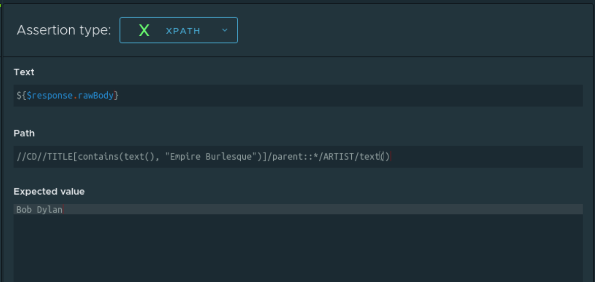
    

**JSONPath**

- 응답이 JSONPath 표현식과 일치하는지 확인
- 값은 예상 요소의 배열로 표시되어야 함
    
    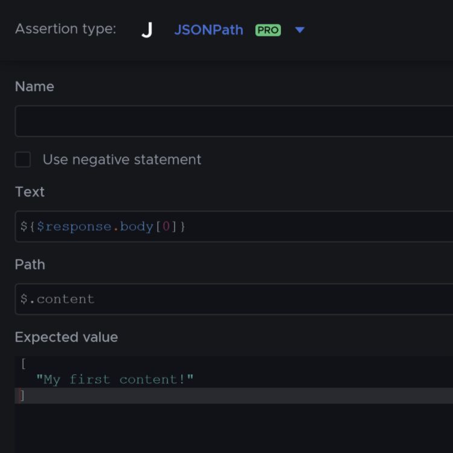
    

**JavaScript assertion**

- 작성한 자바스크립트를 실행하여 true 반환 시 성공, false 반환 시 실패 처리
- 스크립트 실행 중 예외 발생 시 실패로 처리
    
    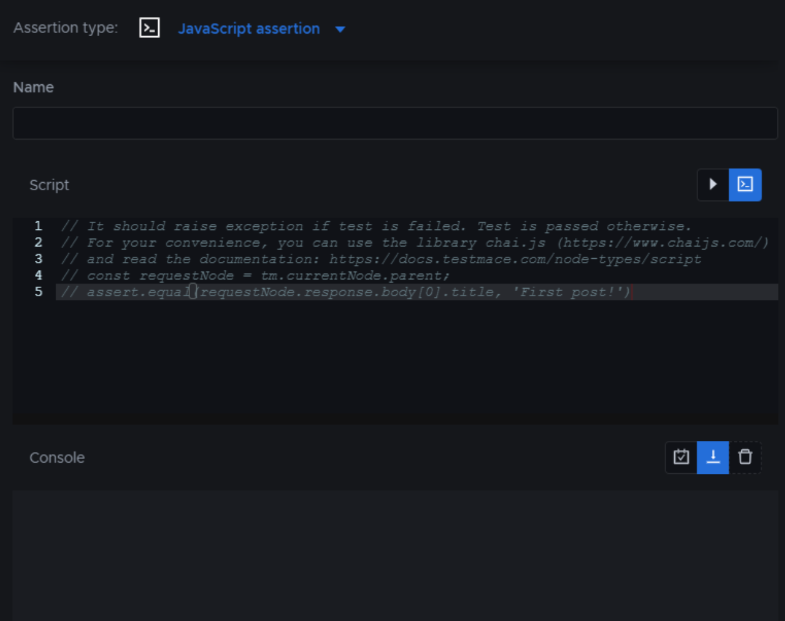
    

### Link

---

- Folder 또는 Request 노드를 링크 지정하여 재사용 가능
- 지정한 노드에 설정된 변수를 가져와서 링크 내부에서 변수 덮어쓰기 가능
- ex ) 다른 토큰을 사용하여 테스트를 진행해야 할 때
    
    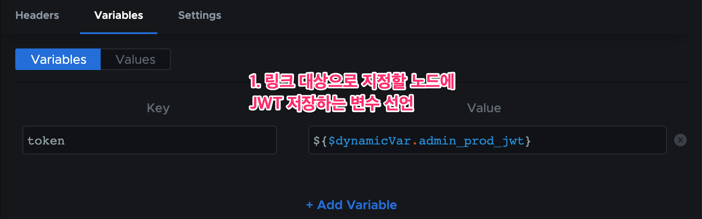
    
    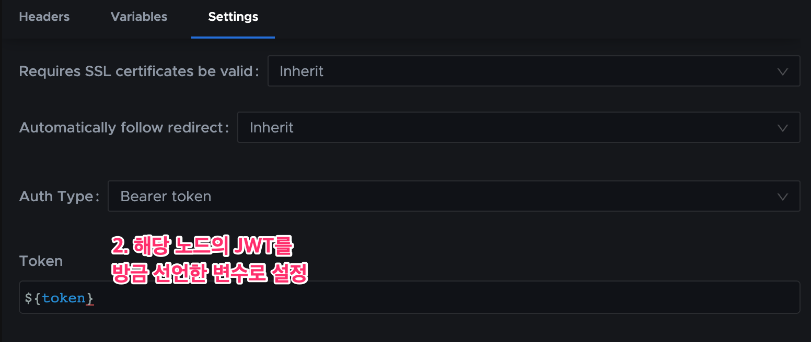
    

# 4. 변수

- TestMace 에서는 환경 변수뿐만이 아닌, 노드 내부에서 변수 정의 가능
- 부모 노드로부터 변수 상속이 가능
- 자식 노드에서 상속받은 변수 재정의 가능

### 기본 변수 종류

---

**$prevStep**

- 이전 노드 변수에 대한 참조

**$nextStep**

- 다음 노드 변수에 대한 참조

**$parent**

- 부모 노드 변수에 대한 참조

**$response**

- 서버 응답값

**$env**

- 현재 설정되어 있는 환경변수

**$dynamicVar**

- 동적 변수 참조

### 정적 변수

---

- 특정 노드와 연관될 고유한 변수
- 변수 값에서 다른 변수 참조도 가능
    
    
    

### 동적 변수

---

- 시나리오가 실행될 때 값이 결정되는 변수
- JWT 할당 또는 새로 생성된 엔티티 저장할 때 사용하면 효과적
- $\{dynamicVar.변수이름\} 형식으로 사용 가능

### 변수 내부에서 JavaScript 사용 가능

---

```jsx
// faker로 더미데이터 생성
${faker.internet.email()}

// 문자열의 해시를 계산
${crypto.MD5('Hello')}

// 변수를 매개변수로도 전달가능
${crypto.MD5($dynamicVar.data)}

// 문자와 문자 사이 결합
${'my password: ' + crypto.MD5($dynamicVar.password)}
```

# 5. CLI

### 사용 사례

---

- API 구현 변경 후 GUI 없이 빠른 테스트
- 버전 관리 시스템에서 커밋하기 전에 자동으로 테스트 실행
- 자동 통합 또는 CI/CD 전달 중 테스트 실행
- API 운영 및 안정성 모니터링을 위한 정기적인 예정된 테스트

### 설치

---

- node.js 버전 10 이상 설치 필요

```bash
npm install --global @testmace/cli
```

### 실행

---

- **모든 테스트 성공 시 return 0, 그렇지 않으면 return 1**
- **로컬 프로젝트 실행**
    
    ```bash
    testmace-cli <full_path_to_project>
    ```
    
- **클라우드 프로젝트 실행**
    
    ```bash
    testmace-cli -p <project_id> -t <access_token>
    ```
    
- **--help**
    
    ```bash
    Usage: testmace-cli [options] <pathToProject>
    
    Options:
      -V, --version                    버전 번호 출력
      -e, --environment [environment]  환경변수
      -r --reporter [reporter]         보고서
      -p --project [project]           클라우드 프로젝트 id
      -t --token [token]               클라우드 액세스 토큰
      -o --output [path]               경로로 보고서 내보내기
      -n --report-name [name]          보고서 파일명
      -h, --help                       help
    ```
    

### 클라우드 프로젝트 id 조회 방법

---

1. [TestMace Dashboard 접속](https://dashboard.testmace.com/projects)
2. 조회할 프로젝트 선택
3. 복사 후 사용

### access_token 조회 방법

---

1. [TestMace Dashboard 접속](https://dashboard.testmace.com/projects)
2. 프로필 페이지로 이동
    
    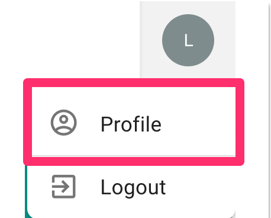
    
3. (없다면 생성 후에) 복사 후 사용
    
    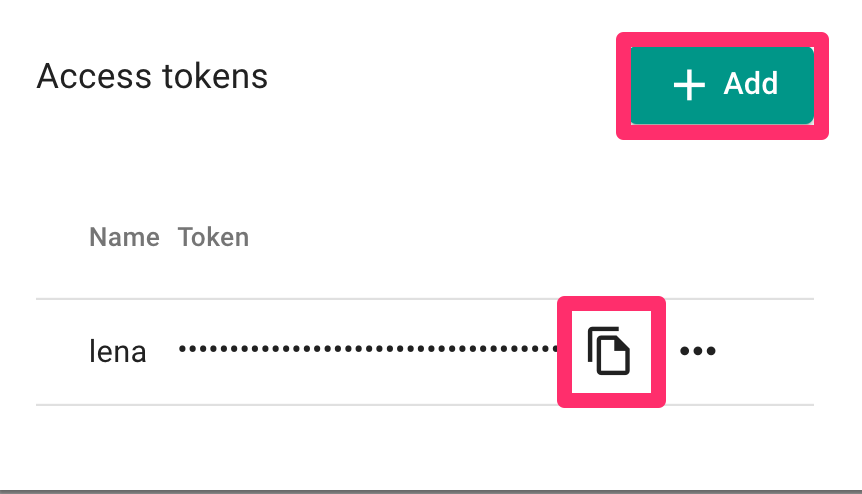
    

# 6. Postman 과의 비교

### 간편한 사용

---

**Postman**

- 생성 가능한 최소 단위: Request
- Request 내부에 Script가 있어서 복잡한 시나리오에서는 유연하지 않은 접근 방식

**TestMace**

- 필요한 기능별로(Request, Script, Assertion ...) 노드가 분리되어 있음
- 노드들을 드래그로 쉽게 결합할 수 있으므로 사용이 편리
- no-code concept 를 지향하여 반복적인 Script 작성을 하지 않을 수 있도록 강력한 GUI 제공

### 동적 변수를 설정할 경우

---

**Postman**

- 자바스크립트 코드 작성 필요
    
    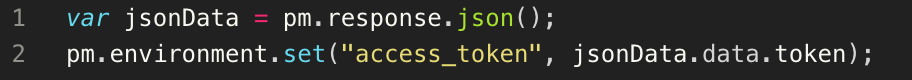
    

**TestMace**

- 스크립트 작성이 필요없음
- 편리한 변수 관리
- 변수가 적용되는 범위 설정가능 (부모 노드)

### 테스트 코드 작성

---

**Postman**

- 자바스크립트 코드 작성 필요
    
    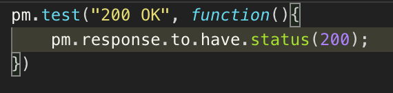
    

**TestMace**

- 스크립트 작성이 필요없음
- GUI를 통해서 간단한 테스트 쉽게 생성 가능

### 동일한 시나리오에서의 변수 변경

---

**시나리오**

- CMS API 를 계정별로 따로 로그인하여 테스트 하고자 한다.

**Postman**

- 다음 작업을 일일해 해줘야해서 번거로움
    1. 계정 1 로그인
    2. API 테스트
    3. 계정 2 로그인
    4. 다시 한 번 API 테스트

**TestMace**

- 링크 노드 사용하여 자동화 가능

### 변수 범위 제어

---

**Postman**

- 변수를 정의할 수 있는 가장 작은 범위가 컬렉션

**TestMace**

- 모든 Request, 폴더 노드에 대한 변수 범위를 정의 가능

### Header 상속

---

**Postman**

- 기본 기능에 없음
- Script 사용 필요

**TestMace**

- 기본 기능으로 제공
- GUI 제공되어 편리하게 사용가능
- 특정 자식 노드에서 헤더 상속을 비활성화하는 옵션 존재
