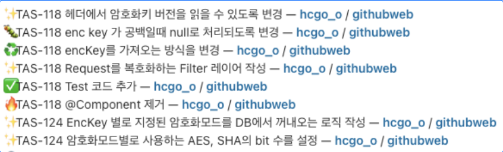
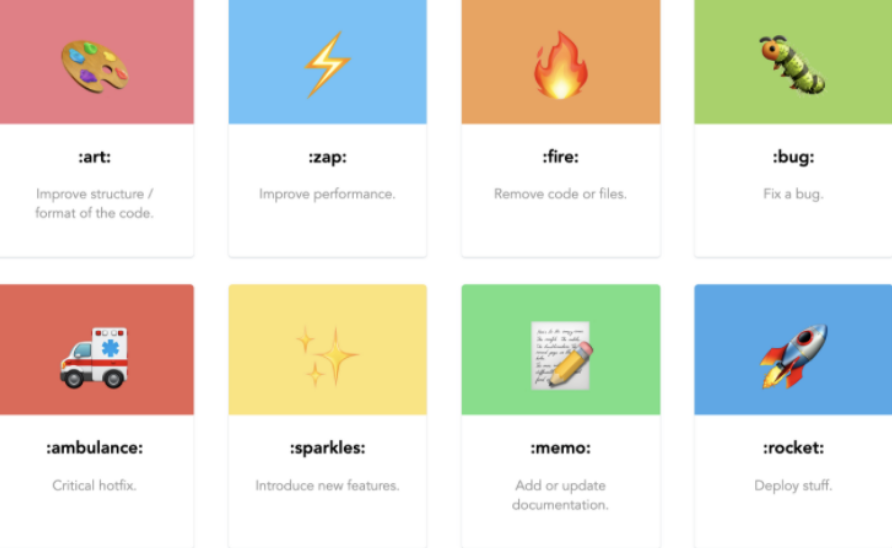
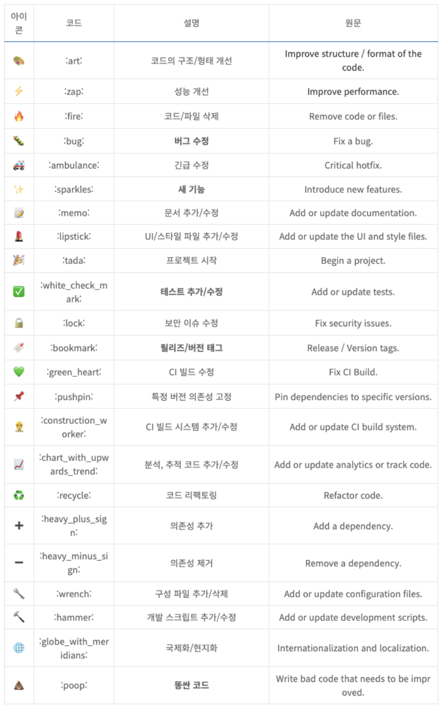
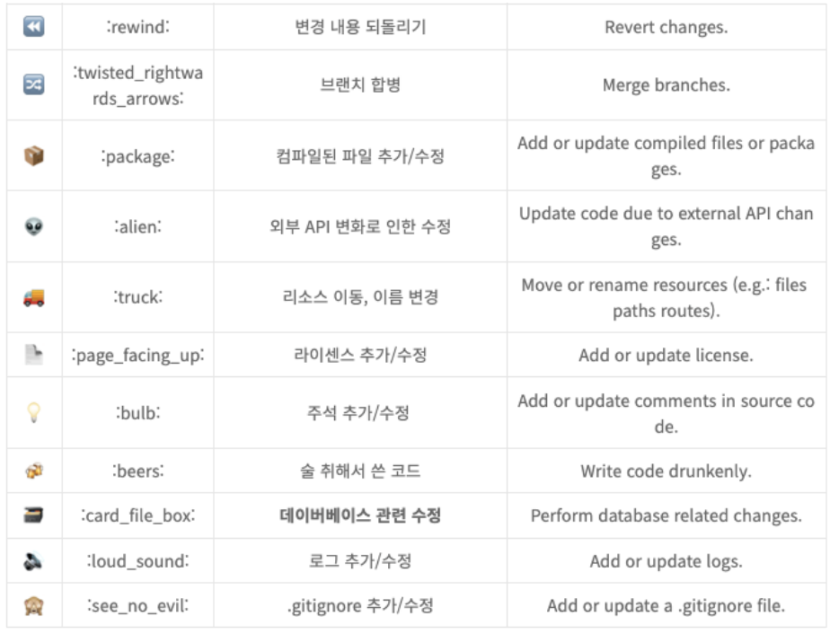
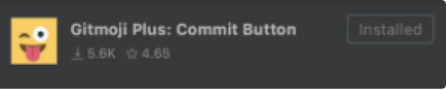
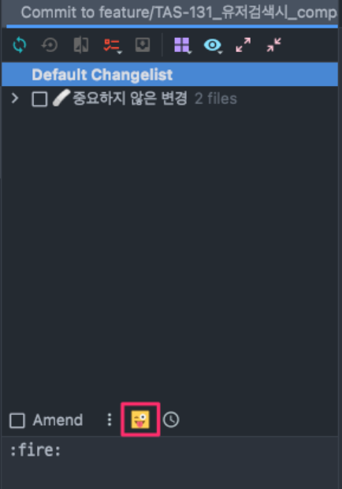

# Gitmoji 란?

- github 커밋 메시지에 **이모지 사용을 표준화하고 설명**하기 위한 구상입니다.
- 커밋 메시지에 이모티콘을 사용하면 사용된 이모티콘만 보고 **커밋의 목적이나 의도를 쉽게 식별**할 수 있습니다.
- 링크: [https://gitmoji.dev](https://gitmoji.dev/)

- 사용 예시

- 이모티콘을 클릭하면 이모티콘이 복사됨

## IDE(Jetbrains) 플러그인으로 사용하기

- Marketplace - Gitmoji Plus: Commit Button 검색하여 설치
    
    
    
- 커밋 창에서 해당 버튼 클릭하여 사용가능
    
    
    

> 출처: [https://treasurebear.tistory.com/70](https://treasurebear.tistory.com/70)
