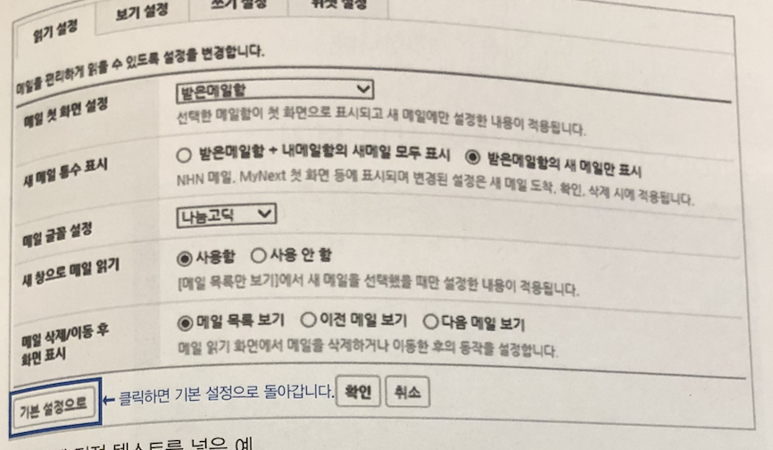
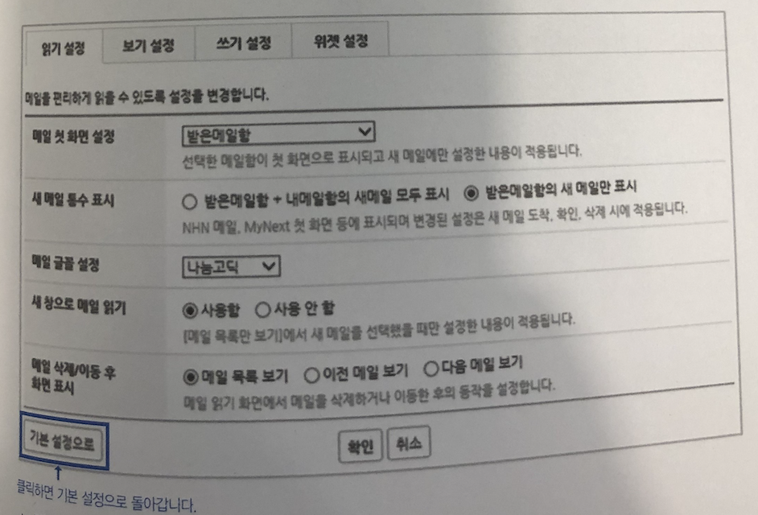

# 문서작성 계획 세우기

## 1.  대상 독자를 정한다.

### 독자 분석 체크리스트

- 독자가 원하는 게 무엇인가
- 독자는 이 문서를 보고 무엇을 하려 할까
- 독자의 기술 수준은 어떻게 되나
- 독자가 이미 알고 있는 정보는 무엇인가
- 어떤 직업, 어떤 직위에 있는 사람인가
- 독자의 학력과 전문 용어 이해 수준은 어느 정도인가
- 저자와 독자는 어떤 관계가 있는가
- 주제에 관해 독자가 이미 알고 있는 사실은 어떤 것인가
- 독자가 이 글을 이해하는데 필요한 사전 정보는 무엇인가
- 독자에게 어떤 반응을 기대하는가

---

## 2. 설명할 기술의 깊이를 조절한다

> 독자가 이미 알고 있는 내용에 따라 전문 용어를 어떻게 써야하는지,
개념 설명은 어디까지 해야 하는지 등이 달라진다.

### 안드로이드 SDK 설명하는 문서의 예시

- 안드로이드 개발자
    - 간단하게 설명하면됨
    - 여기에서는 안드로이드 SDK를 설명한다.
- 개발자는 아니지만 관련분야에 지식이 있는 사람
    - 용어에 관한 간단한 설명
    - SDK는 'Software Development Kit'의 약자로 개발자는 SDK를 사용해 기능을 확장하고 다른 소프트웨어와 통합 작업등을 수행할 수 있다. 여기에서는 특히 안드로이드에서 사용하는 SDK를 다룬다.
- 개발 분야와는 전혀 상관없는 사람
    - 전문 용어를 쓰지 않고 쉽게 쓰는 것이 좋음
    - 여기에서는 제품 기능을 어떻게 확장할 수 있는지 알아보겠다.

### 비개발자

- 개념이나 기본 정보, 기본 용어를 먼저 설명
- 글을 쓰고나서 반드시 독자관점에서 읽어보고 빠진 내용없는지 검토필요

### 개발자

- 일반적인 용어 설명 하지않아도됨
- 용어뿐 아니라 내용을 설명할 때도 기초적인 내용을 길게하면 오히려 지루해질수있음
→ 간단하게 언급만 하는 것이 좋다.

### 독자가 섞여있을때

- 각 독자수준에 맞춰 일단 내용을 모두 작성 후, 필요한 정보만 선택해 볼 수 있게
**목차를 잘 만들어야한다.**
- 문서 앞부분에 독자별로 읽을 장이나 절을 따로 소개한다.

---

## 3. 분위기를 좌우할 어조를 정한다.

- 대상 독자나 문서를 쓰는 목적에 따라 정해야한다.
- **제품이나 서비스의 성격, 주요 사용자층, 전달하고 싶은 이미지 등을 고려해 정해야함.**

### 예시

- 앱의 개선사항
    - '~할 수 있어요', '~ 나타나요' 와 같은 친근한 어조를 사용
    - 앱은 직무, 나이, 기술 지식 등과 상관없이 누구나 독자가 될 수 있으므로 **부드러운 어조 사용**
- 자바 업데이트 화면
    - '~하십시오' 와 같은 형식적인 어조
    - 예상 독자는 특정 기술 지식이 있고 특정 직무를 가진 사람이므로 형식적인 어조 사용

---

## 4. 주제를 구체적으로 정한다.

### 클라우드 서비스 사용자 가이드에 관한 글을 작성하고자 할때

- 클라우드 서비스 중에서 어떤 내용을 쓸 것인지 **구체적이고 명확한 주제**를 먼저 정해야함
    - 클라우드 서비스는 매우 방대하기에 다뤄야 할 내용도 많고,
    한 사람이 이 내용을 모두 알고 쓸 수도 없기 때문에
- 큰 범위 내에서 주제를 구체적으로 좁혀나가야 한다.
    - ex) MySQL 용 데이터베이스 서비스 사용법
    - ex) GitHub를 사용한 효율적인 문서 검토 방법
    - ex) Firebase로 웹 사이트 퍼블리싱하기
    - ex) JavaScript에서 타임존 다루기
- 주제는 작성자가 가장 자신있게 쓸 수 있고 확실하게 알고있으며,
경험담과 사례도 많이 제시할 수 있는 것으로 정하면 좋다.
- 무엇을 쓸지 범주를 정했다면 광범위하고 막연한 주제는 아닌지 생각해보고,
작성자가 다룰 수 있는 범위로 주제를 한정하는 것부터 시작

---

## 5. 작성할 문서의 종류를 정한다.

> 대상 독자를 정했으면 그에 맞춰 어떤 종류의 문서를 쓸 것인지 정한다.
> 

### 메일

- 정보를 간단하게 공유하고 업무를 요청할 목적으로 작성한다.
- 지정한 독자에 맞게 필요한 내용을 가감해야 한다.

### 회의록

- 협의한 내용을 공유하고 오래 기억할 수 있게 작성하는 문서 형식
- 회의 날짜, 참석자를 적어야 하며,
참석하지 않은 사람이 나중에 읽어도 내용을 이해할 수 있게 명확하게 써야한다.

### 보고서

- 어떤 대상을 조사하거나 현상을 오래 관찰한 결과를 정리해 일정한 양식을 갖춰 작성한 글
- 발표용 보고서 - PPT
- 발표용x - 메일, 위키

### 가이드

- 제품이나 서비스 사용방법, 특정 작업을 수행하는 방법 등을 설명한 문서
- **퀵 스타트 가이드**
    - 제품이나 서비스를 처음 접하는 사용자가 **빠르게 주요기능을 익힐 수 있게** 만든 문서
    - 비디오 형식으로도 많이 만듬

### 튜토리얼

- 제품이나 서비스를 어렵지 않게 시작할 수 있도록 **단계별로 하나하나 이끌어주는 문서**
- ex) 라면 봉지에 있는 조리법
- 가이드를 작성할 때보다 이미지를 많이 활용해 **직관적으로** 내용을 전달해야함
- 복잡하고 자세한 배경정보는 생략, **일단 빠르게 제품과 친숙해지게 하는 것이 목적**
- 특정 과제를 주제로 삼고 처음부터 끝까지 그대로 따라하면 결과를 쉽게 얻을 수 있도록 구성해야 한다.

---

# 초안 작성법

## 1. 일단 쓴다.

- 그냥 생각나는 대로 일단 쓴다.
- 문법이나 맞춤법 틀려도 상관없음
- 준비 단계에서 정한 독자를 떠올리며 독자가 궁금해할 내용, 전달해야 할 내용을 빠짐없이 추가하는데만 집중

### 명확성

- 다루는 내용이 정확해야 하고 전달하는 방식과 표현도 선명해야한다.
- 사실을 정확하게 전달하는 것이 목적이므로 단정적이지 않은 표현, 추측성 표현 등은 독자에게 신뢰를 주기 어려움
- 단호하고 명확한 설명과 표현을 사용해야함

### 간결성

- 원하는 정보를 빠르게 알리려면 문장을 간결하게 써야함
- 문장을 짧게 유지하고, 단락 역시 5개 안팎의 문장으로 구성하면 좋다.
- 짧고 쉽게 쓰도록 신경써야한다.

### 일관성

- 문서 전체에서 설명하는 내용이 일관돼야함
- 같은 의미의 용어나 설명 방법도 일관되게 유지해야한다.

## 2. 핵심부터 쓴다.

- 기술문서는 정확한 내용을 빠르게 전달하는 것이 목적
→ **핵심을 가장 먼저 쓴다. (역피라미드 방식)**
- 기술 문서 독자는 대체로 매우 바쁘며 문제를 해결하거나 모르는 기능을 빠르게 익히고자 문서를 찾는다.
그러므로 핵심만 일단 파악하고 부연 설명은 시간이 되면 읽을 때가 많다.

### 역피라미드 방식

- 결론 - 핵심 - 주제 순으로 쓰는 방식

## 3. 제목에 요점을 담는다.

- 제목만 봐도 다루려는 내용이 무엇인지 파악할 수 있게 만들어야한다.

### 제목 작성시 고려할 항목

- 내용이 무엇인지 한눈에 알 수 있는가
- 부제목에 필요하지 않은가
- 목적과 방법을 명확하게 알수있는가
- 명사만 나열하지 않고 의미를 정확하게 서술했는가
- 널리 알려지지 않거나 표준이 아닌 약어를 사용하지는 않았는가

## 4. 문장 하나에는 주제를 하나만 쓴다.

- 같은 내용을 쓰더라도 짧게 쓰는 것이 좋다.

## 5. 객관적인 근거를 댄다.

- 기술 문서에서는 감정에 호소하거나 주관적인 것이 아닌 **객관적으로 입증된 명확한 근거를 대야한다.**
- 추측성 주장이나 입증되지 않은 사실은 쓰지않고, **객관적인 수치나 근거를 제시해야 글의 신뢰도가 높아짐**
- 특히 수치데이터가 효과적
- ex) A 서버보다 B 서버에서 파일을 로딩하는 속도가 훨씬 빨랐다.
→ 파일을 로딩할 때 A 서버를 사용하면 1.5초, B 서버를 사용하면 0.9초가 걸렸다.
- ex) 불과 얼마 전까지만 해도 데이터 센터를 바라보는 시선이 그리 좋지 만은 않았다.
→ LEED Platinum 인증을 받기 전까지 데이터 센터를 바라보는 시선이 그리 좋지만은 않았다.

## 6. 전문 용어는 독자에 맞게 사용한다.

- 독자가 이해하기 어려운 전문 용어, 특정 집단만 이해할 수 있는 은어나 줄임말은 쓰지 않아야함
- 독자층이 넓은 서비스 가이드의 경우엔 한자어나 외국어를 되도록 사용하지 않고,
쉽게 이해할 수 있는 우리말로 순화해야함

### 일반 사용자가 알기 어려운 전문용어를 사용한 예시

- 사용자가 입력한 파라미터 값이 에러가 발생했을 때 나타나는 에러 코드입니다.
→ 사용자 입력 값이 잘못되었을 때 나타나는 오류 코드입니다.
    - '파라미터 값' 이라는 표현은 일반 사용자가 꼭 알아야하는 표현이 아님
    - 꼭 써야겠다면 그 표현의 풀이도 함께 적어야함
- 서비스의 기술 문의 엔트리 포인트는 클라이언트팀 소속입니다.
→ 서비스 기술 문의 담당자는 클라이언트팀 소속입니다.
      → 서비스 기술 문의 담당자는 클라이언트팀 소속입니다.
    - 한자나 외국어를 남용하지 않게 주의해야함
    - '엔트리 포인트'를 대체할 수 있는 우리말이 없거나, 우리말로 대체했을 때 이해하기 더 어려운 것이 아니므로 '기술 문의 담당자'로 사용하는 것이 자연스럽고 더 이해하기 쉽다.

## 7. 용어와 약어를 쓸 때는 풀이를 쓴다.

## 8. 용어는 일관되게 사용한다.

- 테크니컬 라이팅은 정보를 빠른 시간 안에 전달하는 것이 목적
- 독자가 혼동하지 않도록 최대한 단순하고 일관되게 작성해야 한다.
- 혼용하고 있는 용어나 표현이 있는지 확인하고 표준을 정해 일관되게 사용한다.
- 되도록 한글로 사용하는 것을 권장
    - 보안 그룹
    - 인스턴스
    - 로드 밸런서
- 설명 방법도 일관성을 유지한다.
    - 용어뿐 아니라 동작을 설명할때도 같은 표현을 사용하는 것이 좋다.

## 9. 쉽게 쓴다.

- 알고 있는 내용인데도 글로 쓸때는 더 어려운 문장을 만들게 된다.
- **옆 사람에게 말하듯이 작성하면 더 쉽고 간결해진다.**
- 비슷한 내용을 줄이고 꼭 필요한 내용만 남겨 최대한 문장을 짧게 줄인다.
- ex) 화면 상단 우측 위에 위치해 있는 x 버튼을 클릭하면 창이 닫히는 것을 확인할 수 있습니다.
→ 화면 오른쪽 위에 있는 x 버튼을 클릭하면 창이 닫힙니다.
- ex) KM 포장 주문 서비스를 사용하면 귀하의 집의 위치를 기반으로 근거리에 있는 식당의 메뉴를 쉽게 주문할 수 있습니다.
→ KM 포장 주문 서비스를 사용하면 집에서 가까운 식당의 음식을 쉽게 주문할 수 있습니다.
- ex) 내용 검수는 검수 가이드를 바탕으로 하여 검수 절차와 검수 지침에 따라 진행하게 됩니다.
→ 검수 가이드에 따라 내용을 검수합니다.
    - 검수 절차와 검수 지침은 '검수 가이드'에 모두 포함되는 내용이므로
    '검수'는 '검수 가이드에 따라 한다' 라는 내용만 남겨도 충분함

---

# 시각화 요소로 가독성 높이기

### 기술 문서에서 시각 자료를 주로 사용하는 경우

- 시각 자료가 없으면 설명이 복잡하고 길어지는 경우
- 복잡한 설정이 필요한 경우
- 화면을 가리키면서 정보를 제공해야 하는 경우

### 목록

- 단계별로 순서를 나타내거나 그림에 번호를 매기고 번호별로 설명할 때 사용

### 스크린 샷

- 꼭 필요할 때만 넣는다.
    - 간단한 절차 설명이나 입력할 내용이 복잡하지 않을땐 안넣어도됨
- 필요한 부분만 잘라서 넣는다.
- 캡쳐 환경을 통일한다.
    - 프로그램이나 운영체제를 캡처할때는 최신버전에서 캡처한다.
- 그림 크기를 일관되게 지정한다.
- 입력값을 채우고 캡처한다.
    - 사용자에게 중요한 것은 대화상자가 어떻게 생겼느냐가 아니라 **대화 상자 안에 어떤 입력값을 넣는가**임
- **스크린샷 위에 텍스트를 추가하지 않는다.**
    - 나중에 텍스트를 수정하거나 다른 언어로 번역해야 할때 번거롭고, 비용이 많이듬
    
    
    - 그림에 직접 텍스트를 넣은 예
    
    
    - 텍스트를 그림 바깥으로 이동시킨 예
    

### 표

- 여러 제품의 장단점을 항목별로 비교할 때
- 옵션별로 간단한 설명을 적을 때

### 차트

- 데이터를 비교할 때
- 변경 추이를 나타낼 때
- 관계를 표시할 때

## 시각 자료를 쓰기 전에 소개부터 한다.

- 어떤 시각자료를 왜 넣었는지 미리 알려야함
    - 아무 이유없이 다짜고짜 본론부터 시작하면 독자는 '왜지? 뭐지?' 를 떠올리게됨

## 시각 자료를 설명하는 캡션을 활용한다.

---

# 검토와 재작성

## 1. 객관적으로 문서를 검토한다.

### 문서를 검토하는 간단한 방법

- 소리 내어 읽기
    - 눈으로 읽을 때는 문제없이 넘어가던 문장도 소리 내어 읽다보면 매끄럽지 않게 들릴때가 있다.
- 시간을 두고 다시 읽기
    - 최소 24시간이 지난 뒤 다시 읽어본다.
- 온라인 문서라면 인쇄해서 읽기
    - 매체가 달라지면 보이지 않던 오류도 눈에 들어올 때가 있다.

### 문서를 검토할때 확인할 내용

- 내용에 맞는 제목을 달았는가
- 목차가 올바른가
- 용어를 일관되게 사용했는가
- 이해하기 어려운 용어는 없는가
- 필요한 정보가 모두 있는가
- 불필요한 정보가 있지는 않은가
- 내용을 찾기 쉽게 목차를 구성했는가
- 단락은 적절히 나누었는가
- 중복 내용은 없는가
- 표현이 명확한가
- 객관적인 근거가 있는가
- 출처가 명확한가
- 외국어나 한자어가 많이 않은가
- 피동태가 많이 않은가
- 그림이 적절하게 배치됐는가
- 표를 적절하게 사용하는가
