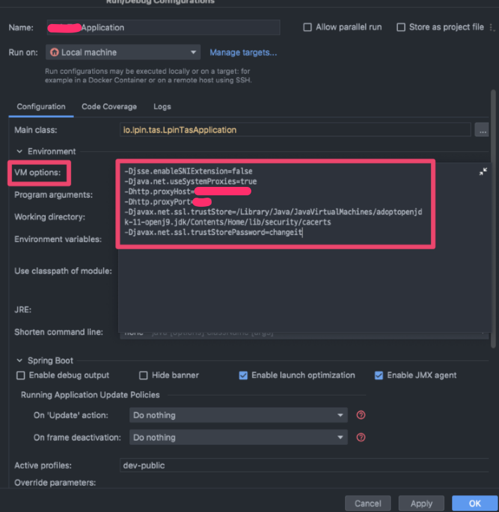

### Java 에서 proxy, SSL 속성은 시스템 속성을 통해 JVM 수준에서 설정됨

1. Application 구동 시 설정 (java -D….)
2. 코드 내부에서 System.setProperty 사용하여 설정

### Java 내부에서 사용할 경우에는 Configurations → VM Options 에서 옵션을 추가하여야함.



### 시스템 프록시 사용하도록 허용

```bash
-Djava.net.useSystemProxies=true
```

### 프록시 호스트 지정

```bash
-Dhttp.proxyHost=127.0.0.1
```

### 프록시 포트 지정

```bash
-Dhttp.proxyPort=8080
```

### JVM이 신뢰할 인증서 저장소 경로 설정 ($JAVA_HOME 에는 자신의 JAVA_HOME 경로 입력)

```bash
-Djavax.net.ssl.trustStore=$JAVA_HOME/lib/security/cacerts
```

### 인증서 저장소의 비밀번호 (default: changeit)

```bash
-Djavax.net.ssl.trustStorePassword=changeit
```

## JAVA 인증서 저장소에 인증서 추가하는 방법

### 터미널에 다음 명령어 입력하여 인증서 추가

```bash
sudo keytool -importcert -keystore <$JAVA_HOME/lib/security/cacerts> -storepass <저장소 비밀번호> -alias <인증서 별칭> -file <추가할 인증서 경로>
```

### 인증서가 정상적으로 추가되었는지 조회

```bash
sudo keytool -list -keystore <$JAVA_HOME/lib/security/cacerts> -storepass <저장소 비밀번호> -alias <인증서 별칭>
```
