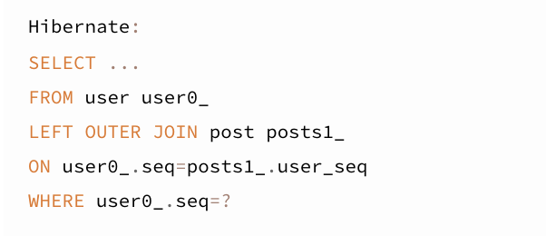
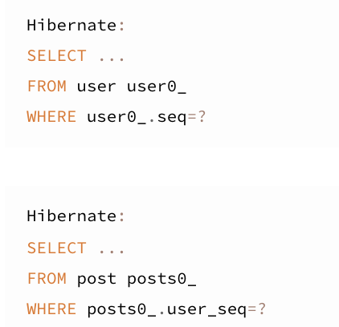

### **Company, Users ApiKey 는 다음과 같은 조건을 가지고 있다고 가정**

**Company**

- 최상위
- Users 에서 새로운 Company 를 만들 수 없음

**Users**

- Company 에 소속됨
- 1개의 Company 에서 파생되서 여러 개가 만들어질 수 있음

**ApiKey**

- Company 1개 당 ApiKey 1개만 생성 가능
- Users 와 직접적인 연관관계는 없다

### **연관 관계 정립 시 앞에 있는 단어(One / Many) 기준으로 model 객체에 설정**

1. **One to Many / Many to One**  
One -> Company  
Many -> Users

2. **One to One**  
One -> Company  
One -> ApiKey

### @OneToMany

Company 객체에 설정

```sql
create table company (
(
    id           bigint auto_increment primary key,
    company_id   varchar(10)  null, // Users에서 참조하는 컬럼
		company_name varchar(100) null,
    is_deleted   varchar(255) null,
    created_at   datetime     null,
    updated_at   datetime     null
);
```

```java
public class Company {
		// Company -> One
		// Users -> Many

		// Company 하나(One)에 여러개(Many)의 Users가 파생되기 때문에 List로 설정해줘야함

		// 참조받는 쪽에서는 참조하는 객체의 리스트가 필요하지 않으면 굳이 없어도됨.
		// ㄴCompany 쪽에서 List<Users>의 정보가 필요하지 않으면 없어도됨

		@OneToMany(fetch = FetchType.LAZY, mappedBy = "company")
		private List<Users> users =new ArrayList<>();

		public void addDevice(Devices devices) {
						// 관계의 주인이 디바이스 객체에 자신의 객체가 변경되었음을 알림
		        devices.setPlaces(this);
						this.devices.add(devices);
		    }
		}
```

### @ManyToOne

Users 객체에 설정

```sql
create table users (
(
    id           bigint auto_increment primary key,
		user_id      varchar(20)  null,
		user_name    varchar(20)  null,
    company_id   varchar(10)  null, // FK
    created_at   datetime     null,
    updated_at   datetime     null,
    is_deleted   varchar(255) null,

		constraint users_company_company_id_fk
        foreign key (company_id) references company (company_id)
);
```

```java
public class Users {
		// Users -> Many
		// Company -> One

		@ManyToOne(fetch = FetchType.LAZY)
		@JoinColumn(name = "company_id")
		private Company company;
}
```

### @OneToOne

```sql
create table app (
(
    id           bigint auto_increment primary key,
		app_key      varchar(40)  null,
		app_name     varchar(20)  null,
    company_id   varchar(10)  null, // FK
    created_at   datetime     null,
    updated_at   datetime     null,
    is_deleted   varchar(255) null,

		constraint app_company_company_id_fk
        foreign key (company_id) references company (company_id)
);
```

```java
public class App {
		@OneToOne
		@JoinColumn(name = "company_id")
		private Company company;
}

public class Company {
		// @OneToMany와 마찬가지로 참조하는쪽의 정보가 필요하지 않으면 굳이 없어도됨.

		@OneToOne(fetch = FetchType.LAZY, mappedBy = "company")
		private App app;
}
```

### FetchType.EAGER

- 즉시 로딩
- 연관관계가 있는 객체에서 데이터를 꺼내올때 join을 사용해서 한꺼번에 (즉시) 꺼내옴



### FetchType.LAZY

- 지연 로딩
- 연관관계가 있는 객체에서 데이터를 꺼내올때 join 사용하지 않고 쿼리를 각각 두 번 생성
    - 첫번째 쿼리 - user 객체에 접근할때
    - 두번째 쿼리 - post 객체에 접근할때
- 연관된 엔티티에 접근할때만 엔티티를 조회


