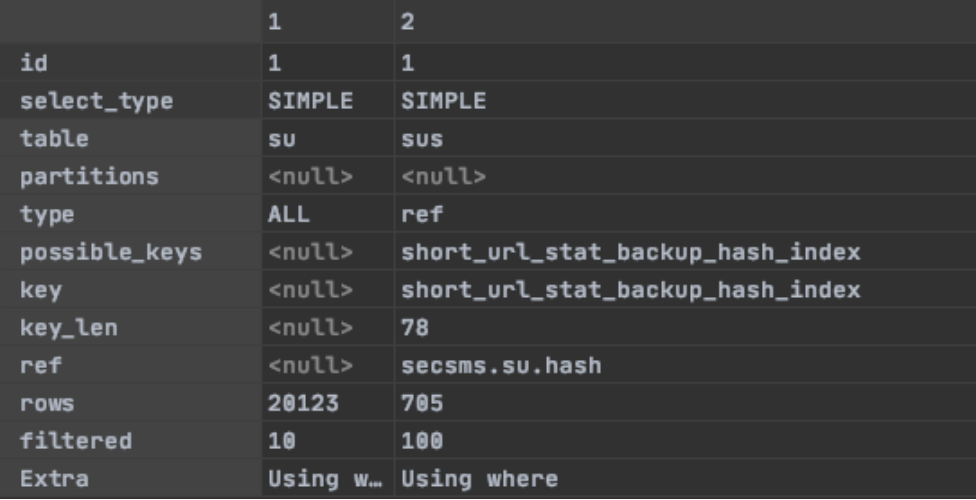

### EXPLAIN

- 실행할 쿼리문 앞에 붙이면 실행계획 출력됨

```sql
EXPLAIN
SELECT * FROM short_url su
LEFT OUTER JOIN short_url_stat sus ON su.hash = sus.hash
WHERE deleted_date IS NULL;

# 해당 쿼리 문제점?
# 이번 이슈 같은 경우는 총 22개의 테이블 조인 중 2번의 self 조인이 발생했는데, 이 조인에서 참조되는 컬럼이 인덱스 되지 않은 컬럼을 self 조인하게 되어 풀스캔되는 현상이었음. 따라서 Query Plan으로 보면, type의 최저의 성능을 내는 ALL 타입의 조인에서 참조 컬럼을 인덱싱하여 검증한 결과, ref 타입으로 변경되어 성능을 회복할 수 있었음
```

→ 위 쿼리문 결과(실행계획)



### id

- 쿼리 내의 select 문의 실행 순서

### select_type

- select 문의 유형
    - **SIMPLE**
        - 단순 select ( union이나 서브쿼리를 사용하지 않음 )
    - **PRIMARY**
        - 가장 외곽에 있는 select문
    - **UNION**
        - union에서의 두번째 혹은 나중에 따라오는 select문
    - **DEPENDENT UNION**
        - union에서의 두번째 혹은 나중에 따라오는 select문, 외곽 쿼리에 의존적임
    - **UNION RESULT**
        - union의 결과물
    - **SUBQUERY**
        - 서브쿼리의 첫번째 select
    - **DEPENDENT SUBQUERY**
        - 서브쿼리의 첫번째 select, 바깥 쪽 쿼리에 의존적임
    - **DERIVED**
        - from절의 서브쿼리

### table

- 참조하고 있는 테이블 명

### type

- 조인타입이며 쿼리 성능과 아주 밀접한 항목
- system – const – eq_ref – ref – ref_or_null – index_mergy – unique_subquery – index_subquery – range – index – ALL (우측으로 갈수록 느림)
- 아래 항목들 중에서 밑으로 갈 수록 안 좋은 쿼리형태임 (총 10개)
    1. **system**
        1. 테이블에 단 하나의 행만 존재(시스템 테이블). const join 의 특수한 경우
    2. **const**
        1. 많아야 하나의 매치되는 행만 존재할 때
        2. PRIMARY KEY 나 UNIQUE index 를 상수와 비교할 때
        3. 각 컬럼값은 나머지 연산에서 상수로 간주, 처음 한번만 읽어들이면 되므로 매우 빠름
    3. **eq_ref**
        1. const 타입 외에 가장 훌륭한 조인타입
        2. 조인수행을 위해 각 테이블에서 하나씩의 행만이 읽히는 경우
        3. 조인연산에 PRIMARY KEY 나 UNIQUE index 인덱스가 사용되는 경우
        4. 인덱스된 컬럼이 = 연산에 사용되는 경우
    4. **ref**
        1. 이전 테이블과의 조인에 사용될 매치되는 인덱스의 모든행이 이 테이블에서 읽혀질 때
        2. 가장 왼쪽 접두사(leftmost prefix)키만을 사용하거나 사용된 키가 PRIMARY KEY 나 UNIQUE 가 아닐때
        → (즉 키값으로 단일행을 추출할수 없을때)
        3. 사용된 키가 적은수의 행과 매치되면 이것은 적절한 조인 타입
        4. ref 는 인덱스된 컬럼과 = 연산에서 사용됨
            1. ex 1)`createdAt between '2022-03-28' and '2022-03-28'` 
            → 해당 쿼리는 결국 createdAt = ‘2022-03-28 00:00:00’ 과 같으므로 **ref** 로 나옴
            2. ex 2)`createdAt between '2022-03-27' and '2022-03-28'` 
            → createdAt ≤ ‘2022-03-27 00:00:00’ and createdAt ≥ ‘2022-03-28 23:59:59’ 와 같으므로 **ALL** 로 나옴
    5. **fulltext**
        1. fulltext 색인을 사용하여 수행됨
    6. **ref_or_null**
        1. ref 와 같지만 NULL 값을 포함하는 행에대한 검색이 수반될 때
        2. 서브쿼리 처리에서 대개 사용됨 (하위 쿼리를 해결하는 데 가장 자주 사용)
    7. **index_merge**
        1. 인덱스 병합 최적화가 적용되는 조인 타입
        2. 이 경우, key 컬럼은 사용된 인덱스의 리스트를 나타내며
        3. key_len 컬럼은 사용된 인덱스중 가장 긴 key 명을 나타냄
    8. **unique_subquery**
        1. 몇몇 IN 서브쿼리 처리에서 ref 타입대신 사용됨
        2. unique_subquery 는 성능향상을 위해 서브쿼리를 단순 index 검색 함수로 대체함
    9. **index_subquery**
        1. unique_subquery 와 마찬가지로 IN 서브쿼리를 대체
        2. 단, 서브쿼리에서 non-unique 인덱스가 사용될때 동작 함
    10. **range**
        1. 인덱스를 사용하여 주어진 범위 내의 행들만 추출
        2. key 컬럼: 사용된 인덱스
        3. key_len: 사용된 가장 긴 key 부분
        4. ref 컬럼: 이 타입의 조인에서 NULL
        5. 키 컬럼이 상수와 =, \<\>, \>, \>=, \<, \<=, IS NULL, \<=\>, BETWEEN 또는 IN 연산에 사용될때 적용됨
    11. **index**
        1. 인덱스가 스캔된다는걸 제외하면 ALL 과 같음
        2. 일반적으로 인덱스 파일이 데이타파일보다 작기 때문에 ALL 보다는 빠름
        3. MySQL 은 쿼리에서 단일 인덱스의 일부분인 컬럼을 사용할때 이 조인타입을 적용함
    12. **ALL**
        1. 이전 테이블과의 조인을 위해 풀스캔
        2. (만약 조인에 쓰인) 첫번째 테이블이 고정이 아니라면 비효율적
        3. 대부분의 경우에 아주 느린 성능
        4. 보통 상수값이나 상수인 컬럼값으로 row를 추출하도록 인덱스를 추가하여 ALL 타입을 피할 수 있음

### possible_keys

- MySQL이 해당 테이블의 검색에 사용할 수 있는 인덱스

### key

- MySQL이 실제 사용한 key나 인덱스

### key_len

- MySQL이 사용한 인덱스의 길이
- key 컬럼의 값이 NULL이면 이 컬럼의 값도 NULL

### ref

- 행을 추출하는 데 키와 함께 사용 된 컬럼이나 상수값

### rows

- 쿼리 수행에서 MySQL이 찾아야하는 데이터행 수의 예상값
- 추정 수치일뿐, 항상 정확하지는 않음

### filtered

- filetered 열에 나타난 조건에 의해 필터링 될 테이블 행의 예상 비율을 나타낸다.
- 즉 rows는 검사 된 행 수를 나타내고 rows * filtered / 100은 이전 테이블과 join될 행 수 표시

### Extra

- MySQL이 이 쿼리를 어떻게 해석하는 지에 대한 추가 정보
