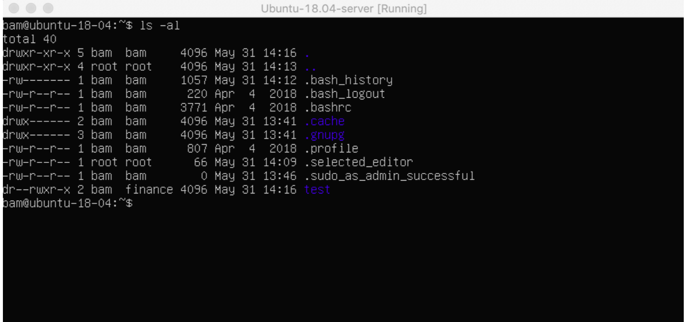

## chmod

- 파일 권한 변경

## chown

- 파일 소유자 변경

```bash
chown [옵션] [소유자:소유그룹] [파일 or 폴더]

# 옵션
# -R: 하위 경로 소유자 모두 변경
# -f: 소유자 변경이 안될때 오류 메시지 표출
# -c: 변경된 파일 자세히 표출
# -v: 작업상태 출력

chown user1 test.txt  # test.txt 의 소유자를 user1 로 변경
chown :group1 test.txt  # text.txt 의 소유그룹을 group1 로 변경
chown user1:group1 test.txt  # text.txt 의 소유자를 user1, 소유그룹을 group1 로 변경
```

### **1. 파일 권한 확인 법**

- 각각의 파일에는 권한이 존재 
- 리눅스 터미널에 다음과 같은 명령어를 입력 하면 해당 경로에 있는 파일 및 폴더 리스트 확인 가능 
- 이때 각각의 맨 앞부분에 있는 문장(drwxr-xr-x)이 해당 파일 및 폴더의 권한을 나타냄

```bash
ls -al
```



### 2. 파일 권한 살펴보기

- |rw-|rw-|r--1 2 3 4

1. Indicates type - 해당 파일의 종류를 나타냄 (Directory, Regular file, Symbolic link 등)

2. 해당 파일(폴더)을 생성하거나 소유하고 있는 유저의 권한을 나타냄

3. 해당 파일(폴더)에 부여된 그룹에 속한 유저의 권한을 나타냄

4. 해당 파일(폴더)에 대한 모든 유저들의 권한을 나타냄

> r = read(읽기), w = write(쓰기), x = execute(실행)

| Permissions |  |  |  |
| --- | --- | --- | --- |
| user | r -read | w -write | x -execute |
| group | r -read | w -write | x -execute |
| others | r -read | w -write | x -execute |

### 3. 파일 권한을 변경하는 방법

1. 문자를 사용하여 변경

- 권한 부여

```bash
chmod g+rw testfile  # 해당 그룹에 속하는 유저에게 읽기와 쓰기 권한 부여
chmod u+r testfile  # 해당 파일을 소유한 사람에게 읽기 권한 부여
chmod ugo+rwx testfile  # 소유자, 그룹, 모든 유저에게 읽기 쓰기 실행 권한 부여 (매우 위험)
```

- 권한 삭제

```bash
chmod g-rw testfile  # 해당 그룹에 속하는 유저에게 읽기와 쓰기 권한 삭제
chmod u-r testfile  # 해당 파일을 소유한 사람에게 읽기 권한 삭제
chmod ugo-rwx testfile  #소유자, 그룹, 모든 유저에게 읽기 쓰기 실행 권한 삭제
```

2. 숫자를 이용하여 변경

파일 권한은 다음 숫자들을 통해 권한 부여 가능

4 = Read

2 = Write

1 = Execute

```bash
# 소유자 :읽기 o 쓰기 o 실행 o, 그룹 : 읽기 o 실행 o, 모든유저: 읽기 o 실행 o
chmod 755 testfile

# 소유자 :읽기 o , 그룹 : 쓰기 o, 모든유저: 실행 o
chmod 421 testfile
```

---

### \<경우의 수\>

**rwx** = 4 + 2 + 1 = **7**

**rw-** = 4 + 2 + 0 = **6**

**r-x** = 4 + 0 + 1 = **5**

**r--** = 4 + 0 + 0 = **4**

**-wx** = 0 + 2 + 1 = **3**

**-w-** = 0 + 2 + 0 = **2**

**--x** = 0 + 0 + 1 = **1**
