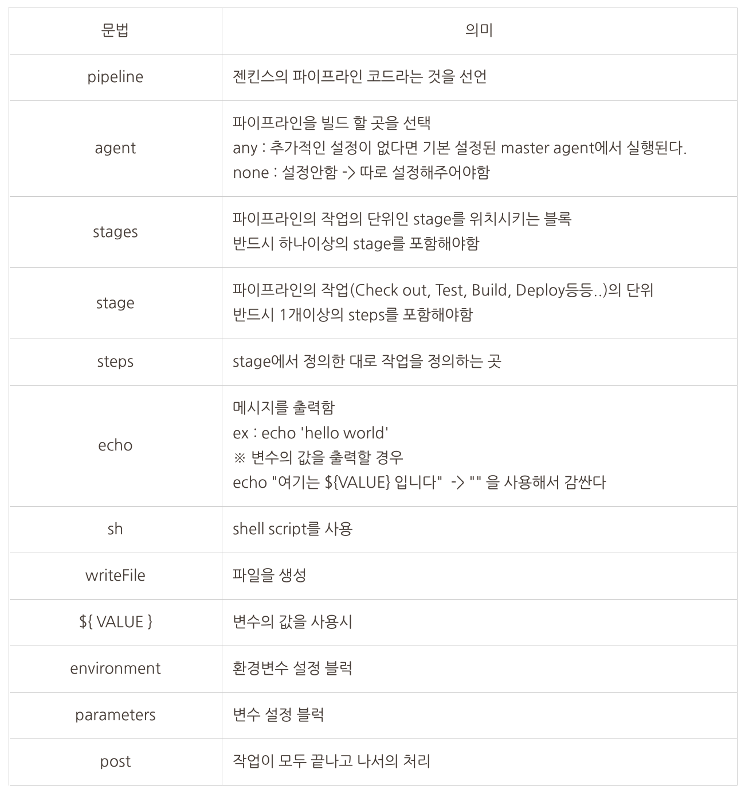

## Declarative Pipeline



### ※ 자주 사용할 용어정리

- node / agent
    - 젠킨스를 사용해서 파이프라인등을 빌드 할때, 빌드되는 곳의 PC 또는 도커 컨테이너
    - node의 경우 Scripted Pipeline의 문법과 표기가 겹치지만 여기선 다른 의미임
- master
    - 젠킨스 서버가 설치된 PC 또는 도커 컨테이너를 의미함
- slave
    - 젠킨스 서버(master)를 통해 리모트로 조작하는 PC 또는 도커 컨테이너

### 예제 코드

```
// 파이프 라인의 선언
pipeline {
  // 빌드되어질 곳을 any로 선언
  agent any
  // 작업의 묶음인 stages 를 선언
  stages {
      // 첫번째 작업('execute ls command')을 선언 
      stage('execute ls command') {
        // 작업의 세부 처리인 steps을 선언
        steps {
          // 'execute ls command' 라는 메시지를 출력
          echo 'execute ls command'
          // shell의 명령어 'ls -la'실행
          sh 'ls -la'
        }
      }
      // 두번째 작업('Where do ls command execute?')을 선언 
      stage('Where do ls command execute?') {
        // 작업의 세부 처리인 steps을 선언
        steps {
          // 'Here is default.' 라는 메시지를 출력
          echo 'Here is default.'
          // shell의 명령어 'ls -la'실행
          sh 'ls -la'
          // 'you can define where to execute command.' 라는 메시지를 출력
          echo 'you can define where to execute command.'
          // 'For example, I want to view root directory' 라는 메시지를 출력
          echo 'For example, I want to view root directory'
          // shell의 명령어 'ls -la /'실행
          sh 'ls -la /'
        }
      }
      // 세번째 작업('Is there any other way?')을 선언
      stage('Is there any other way?') {
         // 작업의 세부 처리인 steps을 선언
        steps {
           // 'Maybe sh is independent' 라는 메시지를 출력
          echo 'Maybe sh is independent'
          // sh 명령어 개별로 사용하여  cd / , pwd , ls -la 명령어를 실행
          sh 'cd /'
          sh 'pwd'
          sh 'ls -la'
          // 'If you want to execute multiple commands in one sh.' 라는 메시지를 출력
          echo 'If you want to execute multiple commands in one sh.'
          // sh 명령어를 묶어서 cd / , pwd , ls -la 명령어를 실행
          sh '''cd /
          pwd
          ls -la'''
        }
      }
    }
  }
```
