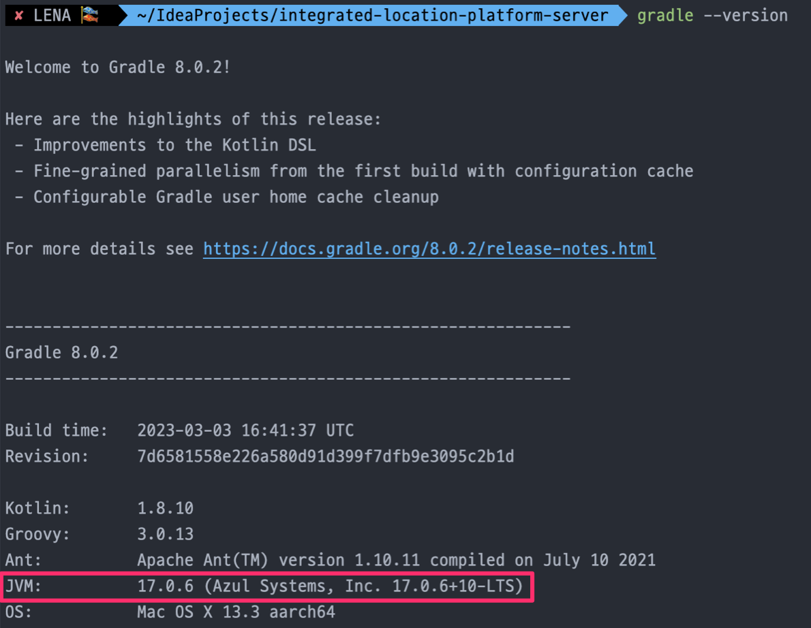
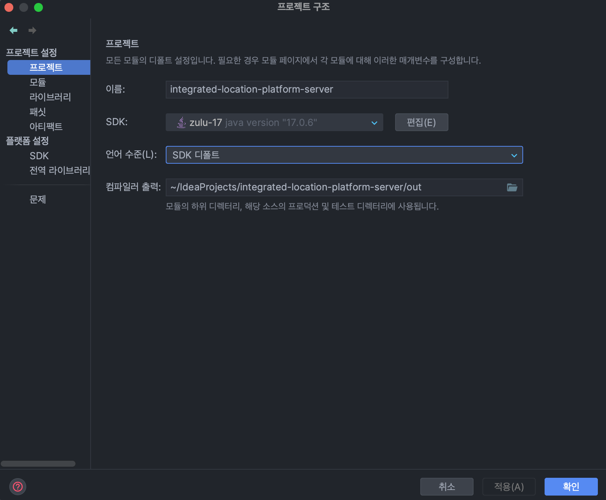
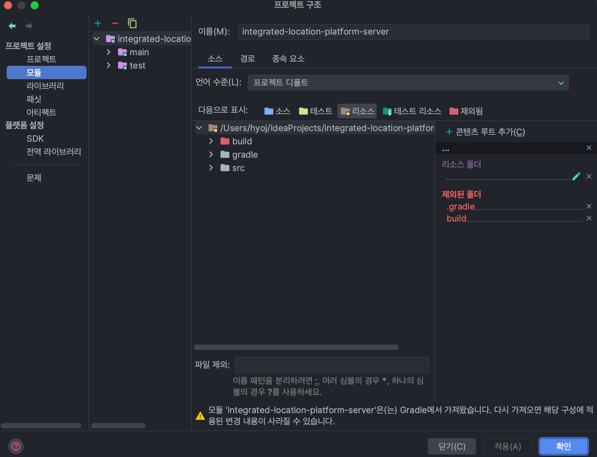

### 1. Java version 17 이상인지 확인

- Spring Boot 3.0 부터는 Java 17 이 필수임

```bash
java --version
```

### 2. build.gradle 의 sourceCompatibility 가 17 이상인지 확인

```groovy
plugins {
    id 'java'
    id 'org.springframework.boot' version '3.0.5'
    id 'io.spring.dependency-management' version '1.1.0'
}

group = 'io.lpin'
version = '0.0.1-SNAPSHOT'
sourceCompatibility = '17' // 17 이상인지 확인
```

### 3. gradle JVM 버전이 17 이상인지 확인

```bash
gradlew --version
# or
gradle --version
```



### 3-1. IntelliJ 에서 gradle JVM 버전 변경 방법

1. Preferences/Settings
2. Build, Execution, Deployment
3. Build Tools
4. Gradle
5. 17 이상으로 설정

![intellij-gradle-jvm](img2.png "intellij-gradle-jvm"

### 3-2 IntelliJ 에서 Project SDK 설정 방법

1. File → Project Structure…
2. Project 설정


3. Modules 설정

