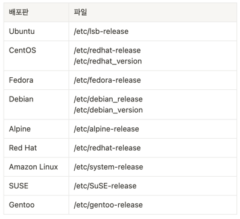

### 배포판 버전 정보 간단하게 출력

```bash
$ cat /etc/issue

# 결과
Welcome to Alpine Linux 3.17
Kernel \r on an \m (\l)
```

### 배포판 버전 정보 상세하게 출력

```bash
$ cat /etc/*-release

# 결과
NAME="Alpine Linux"
ID=alpine
VERSION_ID=3.17.0
PRETTY_NAME="Alpine Linux v3.17"
HOME_URL="https://alpinelinux.org/"
BUG_REPORT_URL="https://gitlab.alpinelinux.org/alpine/aports/-/issues"
```

### 배포판 별 *-release 파일


### 시스템 커널 버전 확인

```bash
# -a: 시스템 정보 전체 출력
# -s: 커널 이름 출력
# -o: OS 이름 출력
# -r: 커널 릴리즈 버전 출력
# -m: 시스템 하드웨어 아키텍처 출력
$ uname -a

# 결과
Linux df61cdcb1653 5.10.124-linuxkit #1 SMP PREEMPT Thu Jun 30 08:18:26 UTC 2022 aarch64 Linux
```
