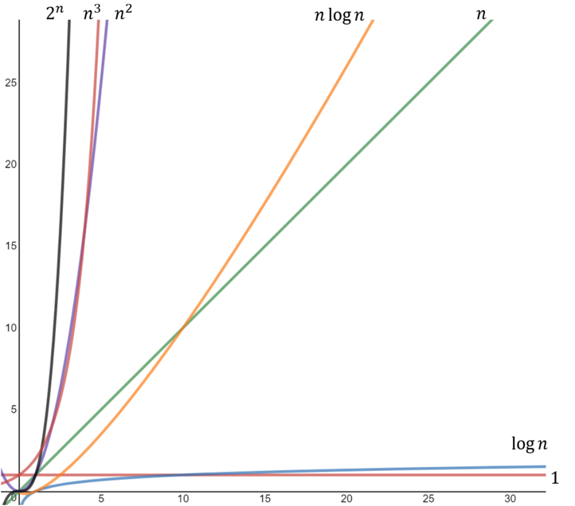

### 1. O(1) - 상수 시간 복잡도
- 예시: 배열의 첫 번째 요소를 가져오는 작업
- 설명: 입력 크기와 무관하게 항상 일정한 실행 시간이 소요됨

### 2. O(log n) - 로그 시간 복잡도
- 예시: 이진 탐색(Binary Search) 알고리즘
- 설명: 입력이 정렬된 경우, 각 단계마다 입력 범위를 반씩 줄이므로 로그 형태의 실행 시간이 소요됨

### 3. O(n) - 선형 시간 복잡도
- 예시: 배열의 모든 요소를 한 번씩 방문하는 작업
- 설명: 입력 크기에 비례해서 실행 시간이 증가

### 4. O(n log n) - 선형 로그 시간 복잡도
- 예시: 합병 정렬(Merge Sort), 퀵 정렬(Quick Sort) 등의 효율적인 정렬 알고리즘
- 설명: 입력 크기와 로그를 곱한 만큼의 실행 시간이 소요됨

### 5. O(n^2) - 이차 시간 복잡도
- 예시: 이중 for 루프를 사용한 정렬 알고리즘
- 설명: 입력 크기의 제곱에 비례하는 실행 시간이 소요됨

### 6. O(2^n) - 지수 시간 복잡도
- 예시: 피보나치 수열을 재귀적으로 계산하는 작업
- 설명: 입력 크기에 대해 지수적으로 실행 시간이 증가

