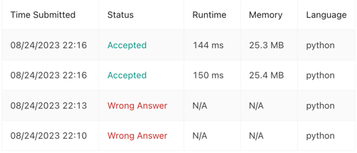

## 189. Rotate Array (배열 회전)

- _링크: [https://leetcode.com/problems/rotate-array](https://leetcode.com/problems/rotate-array)_

> ### 문제 설명
> 
> 정수 배열 `n`이 주어지면 배열을 오른쪽으로 `k` 단계씩 회전합니다. 여기서 `k`는 음수가 아닙니다.
> 
> ### **Example 1:**
> 
> - **Input:**
>   - `nums = [1,2,3,4,5,6,7]`, `k = 3`
>
> - **Output:**
>   - `[5,6,7,1,2,3,4]`
>  
> - **Explanation:**
>   - 오른쪽으로 1단계 회전: `[7,1,2,3,4,5,6]`
>   - 오른쪽으로 2단계 회전: `[6,7,1,2,3,4,5]`
>   - 오른쪽으로 3단계 회전: `[5,6,7,1,2,3,4]`
> 
> ### **Example 2:**
> 
> - **Input:**
>   - `nums = [-1,-100,3,99]`, `k = 2`
> 
> - **Output:**
>   - `[3,99,-1,-100]`
>  
> - **Explanation:**
>   - rotate 1 steps to the right: `[99,-1,-100,3]`
>   - rotate 2 steps to the right: `[3,99,-1,-100]`
> 
> ### **Constraints:**
>
> - `1 <= nums.length <= 10^5`
> - `-2^31 <= nums[i] <= 2^31 - 1`
> - `0 <= k <= 10^5`
>
<br></br>

## 풀이 과정

1. 가장 끝에서 부터 `k` 만큼의 범위를 배열의 맨 앞으로 이동시킬 범위로 설정한다.
    ```python
    startIndex = len(nums) - k
    endIndex = len(nums)
    ```
    
2. 설정한 범위를 배열의 맨 앞으로 옮긴다.
    ```python
    nums[0:0] = nums[startIndex:endIndex]
    ```

3. 삭제할 범위를 설정한다.
    ```python
    startIndex = len(nums) - moveCount
    endIndex = len(nums)
    ```

4. 배열의 맨앞으로 옮긴 부분을 배열에서 삭제한다.
    ```python
    del nums[startIndex:endIndex]
    ```
<br></br>

## 최초 제출 코드
```python
class Solution(object):
    def rotate(self, nums, k):
	
	# 1. 가장 끝에서 부터 k 만큼의 범위를 이동시킬 범위로 설정
	startIndex = len(nums) - moveCount
	endIndex = len(nums)
	
	# 2. 설정한 범위를 배열의 맨 앞으로 옮기기
	nums[0:0] = nums[startIndex:endIndex]
	
	# 3. 삭제할 범위 설정
	startIndex = len(nums) - moveCount
	endIndex = len(nums)
	
	# 4. 배열의 맨 앞으로 옮긴 범위를 배열에서 삭제하기
	del nums[startIndex:endIndex]
```
<br></br>

## 1차 수정

1. 배열 요소가 1개 있는 테스트 케이스에서 실패해서, 배열 요소가 2개 이상 일때만 로직이 실행되도록 조건문을 추가하였다.
    ```python
    if len(nums) > 1:
    ```
<br></br>

## 1차 수정 코드
```python
class Solution(object):
    def rotate(self, nums, k):

	# 1. 배열 요소가 2개 이상일때만 로직 실행
	if len(nums) > 1:
	
	    # 2. 가장 끝에서 부터 k 만큼의 범위를 이동시킬 범위로 설정
	    startIndex = len(nums) - moveCount
	    endIndex = len(nums)
	
	    # 3. 설정한 범위를 배열의 맨 앞으로 옮기기
	    nums[0:0] = nums[startIndex:endIndex]
	
	    # 4. 삭제할 범위 설정
	    startIndex = len(nums) - moveCount
	    endIndex = len(nums)
	
	    # 5. 배열의 맨 앞으로 옮긴 범위를 배열에서 삭제하기
	    del nums[startIndex:endIndex]
```
<br></br>

## 2차 수정

1. 배열 요소 갯수보다 `k` 가 더 높을 경우의 테스트 코드에서 실패해서, 이동시키는 횟수를 구하는 로직을 추가하였다.
    ```python
    moveCount = k % len(nums)
    ```
<br></br>

## 최종 제출 코드
```python
class Solution(object):
    def rotate(self, nums, k):

	# 1. 배열 요소가 2개 이상일때만 로직 실행
        if len(nums) > 1:
            
            # 2. 이동시킬 횟수 구하기
            moveCount = k % len(nums)
        
            # 3. 가장 끝에서 부터 k 만큼의 범위를 이동시킬 범위로 설정
            startIndex = len(nums) - moveCount
            endIndex = len(nums)

            # 4. 설정한 범위를 배열의 맨 앞으로 옮기기
            nums[0:0] = nums[startIndex:endIndex]

            # 4. 삭제할 범위 설정
            startIndex = len(nums) - moveCount
            endIndex = len(nums)

            # 5. 배열의 맨 앞으로 옮긴 범위를 배열에서 삭제하기
            del nums[startIndex:endIndex]
```
<br></br>

## 시간, 공간 복잡도

### 시간 복잡도: `O(n)`
- 범위를 설정하고 이동 및 삭제시키는 부분은 이동시킬 범위의 길이에 비례한 시간이 소요되므로 `O(n)` 의 시간 복잡도를 가진다.

### 공간 복잡도: `O(1)`
- 주어진 배열 `nums` 에서 직접 범위를 옮기고 삭제하기 때문에 `O(1)` 의 공간 복잡도를 가진다.
<br></br>


## 문제 풀이 기록


<br></br>

## 다른 풀이 방법

### 역방향을 사용한 접근법 (시간: `O(n)`, 공간: `O(1)`)
- _*링크:* https://leetcode.com/problems/rotate-array/discuss/269948/4-solutions-in-python-(From-easy-to-hard)

```python
class Solution:
    def rotate(self, nums, k) -> None:
        # 1. 이동할 횟수를 배열의 길이로 나눈 나머지를 구함
        k %= len(nums)
        
        # 2. 배열 전체를 뒤집음
        self.reverse(nums, 0, len(nums)-1)
        
        # 3. 0 부터 k-1 까지의 범위를 뒤집음 (이동할 요소들을 앞으로 옮김)
        self.reverse(nums, 0, k-1)
        
        # 4. k 부터 배열 끝까지의 범위를 뒤집음 (남은 요소들을 뒤로 옮김)
        self.reverse(nums, k, len(nums)-1)

    def reverse(self, nums, start, end) -> None:
        # start와 end가 만날 때까지 요소를 교환하여 배열을 뒤집음
        while start < end:
            temp = nums[start]
            nums[start] = nums[end]
            nums[end] = temp 
            start += 1
            end -= 1
```

## 회고
_이번 문제는 풀고나서 다른 풀이 방법을 찾아봤는데, (내가 찾지 못한 걸수도 있지만)나와 비슷하게 푼 사람들이 없었다._

_나만의 방식으로 문제를 풀었는데 문제가 풀린 것도 신기하고, 시간 복잡도도 `O(n)` 으로 양호하게 나온 것에 만족한다._

_그리고 이번 문제부터는 IDE 를 사용하여 디버깅하면서 문제를 풀기 시작했는데, 디버깅하면서 하니까 훨씬 편한 것 같다. 앞으로도 애용해야겠다!_