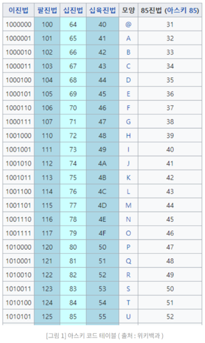

### 컴퓨터 용량 단위

- 1bit
- 1Byte (bit * 8)
- 1KB (Byte * 1024)
- 1MB (KB * 1024)
- 1GB (MB * 1024)
- 1TB (GB * 1024)
- 1PB (TB * 1024)

 

> 용량단위에서 bit 를 제외한 다른 단위들은 1024 를 곱하면 다음 단위로 넘어간다.
> 
> → _왜 bit 만 8을 곱하는 걸까?_
 
 

### 문자 표현 단위

- 문자를 표현할때 가장 작은 단위는 1Byte 임.
    - ex) 공백(" "), 알파벳, 숫자 등등…
    - 한글, 한자 등은 2Byte
- 문자 표현의 표준 포맷으로는 `ASCII`, `ANSI`, `UNICODE` 등이 존재.
- `ASCII` → `2^7` = 128개의 문자조합(`0~127`) + 패리티비트(`1bit`) = **`8bit` = `1Byte`**
    - 이진수 범위: `000 0000` ~ `111 1111` + 패리티비트 `0 ~ 1`
- `ANSI` → `2^8` = 256개의 문자조합(`0~255`) = **8bit = 1Byte**
    - 이진수 범위: `0000 0000` ~ `1111 1111`
- `UNICODE` → `2^16` = 65536개의 문자조합(`0~65535`) = **16bit = 2Byte**
    - 이진수 범위: `0000 0000 0000 0000` ~ `1111 1111 1111 1111`
- 문자가 해당되는 코드번호의 이진수를 가져오면 **8자리 혹은 16자리의 이진수가 됨** (8bit or 16bit)
    

  

### 결론

- 문자 표현 포맷 테이블을 참조하면 8bit로 1개의 문자, 즉 1Byte가 표현되는 것을 알수있음.
- 그러므로 8bit → 1Byte 이다.

 

_참조: https://code-lab1.tistory.com/233_